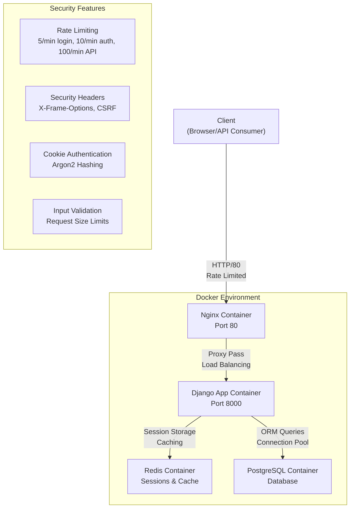
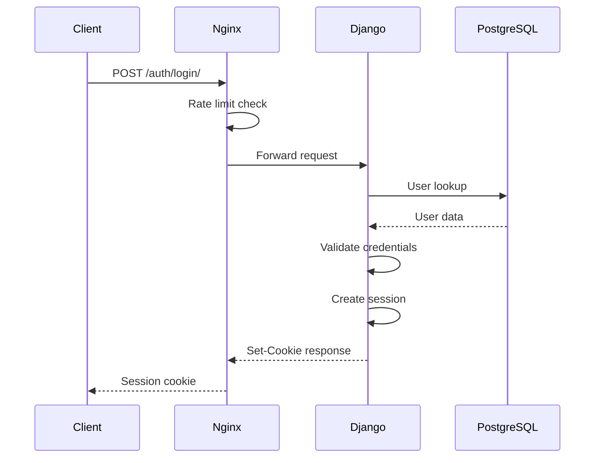
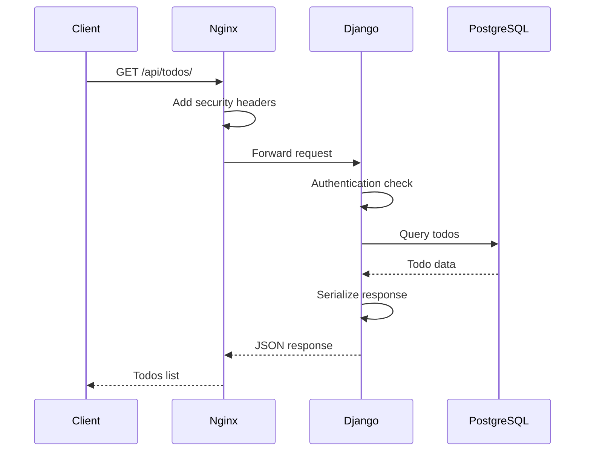
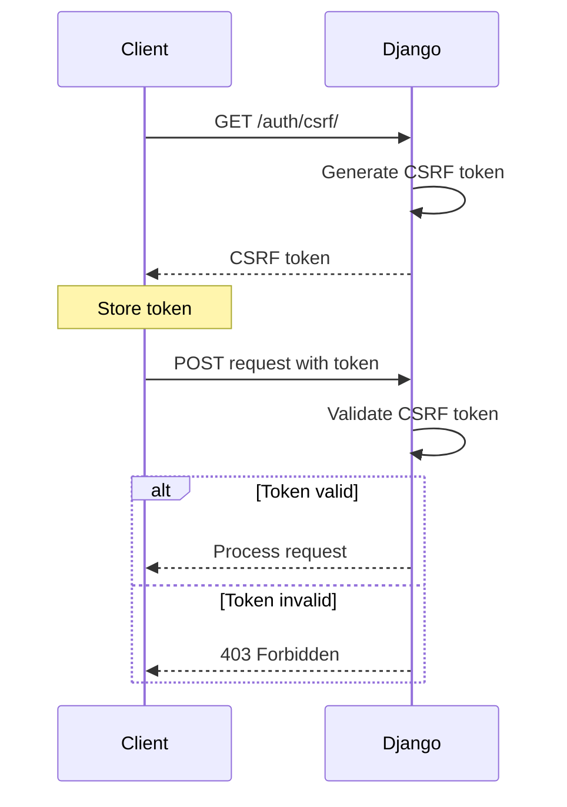
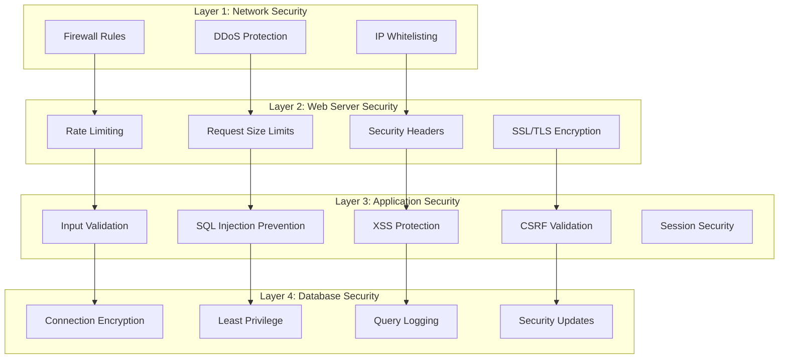
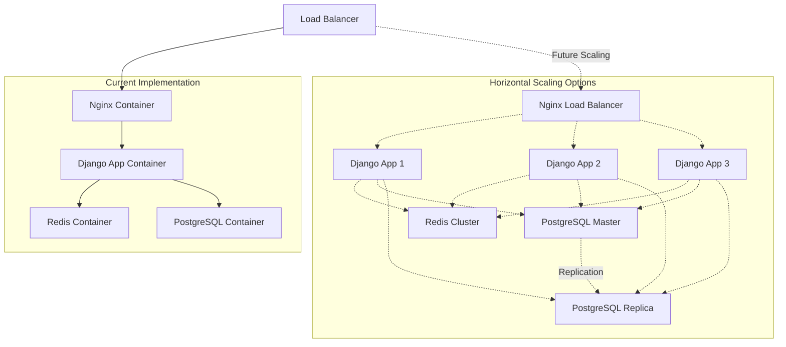

# Detailed Architecture Overview

## System Architecture Diagram



## Component Deep Dive

### 1. Client Layer

**Technologies**: Any HTTP client (Browser, Mobile App, CLI, etc.)

**Responsibilities**:
- API requests to backend endpoints
- CSRF token management for POST requests
- Session cookie handling
- Authentication token storage
- HTTP communication via REST API

**Security Features**:
- HttpOnly cookies (prevents XSS access)
- Secure flag (HTTPS only transmission)
- SameSite attribute (CSRF protection)

### 2. Web Server Layer (Nginx)

**Container**: nginx:alpine
**Configuration**: `/nginx/nginx.conf`

**Core Functions**:

#### Reverse Proxy Configuration
```nginx
upstream django_app {
    server app1:8000;
}
```

#### Rate Limiting Implementation
- **Login endpoints**: 5 requests/minute per IP (burst=3)
- **Auth endpoints**: 10 requests/minute per IP (burst=5)
- **API endpoints**: 100 requests/minute per IP (burst=20)
- **Zone-based limiting**: Separate zones for different endpoint types

#### Static File Serving
- **Static files**: `/app/staticfiles/` with 1-year cache
- **Media files**: `/app/media/` with 30-day cache
- **Gzip compression**: Enabled for text/json/js/css

#### Security Headers
```nginx
add_header X-Frame-Options DENY always;
add_header X-Content-Type-Options nosniff always;
add_header Referrer-Policy no-referrer always;
add_header X-XSS-Protection "1; mode=block" always;
```

### 3. Application Layer (Django)

**Container**: Custom Django app
**Framework**: Django with Django REST Framework
**Documentation**: drf-spectacular (Swagger/OpenAPI)

#### Core Components

**Models**:
- `User`: Custom user model with UUID primary key, email authentication
- `Session`: Custom session model with IP tracking and expiration
- `List`: Todo list container with user association and color support
- `Todo`: Individual task items with status, priority, and versioning

**Authentication System**:
- **Custom session management**: Redis-backed with IP validation
- **Password Hashing**: Argon2 (single hasher for performance)
- **CSRF Protection**: Token-based with HttpOnly cookies
- **Cookie Security**: HttpOnly, Secure, SameSite=Lax

**API Architecture**:
- **Class-based views**: APIView with OpenAPI documentation
- **Custom serializers**: Input validation and data transformation
- **Cursor pagination**: JSON-based pagination for performance
- **Caching strategy**: Redis caching for user data and queries

**Middleware Stack**:
1. `OptimizedMiddleware` (custom performance middleware)
2. `SecurityMiddleware` (Django security features)
3. `SessionMiddleware` (session management)
4. `CommonMiddleware` (common request processing)
5. `CsrfViewMiddleware` (CSRF protection)
6. `AuthenticationMiddleware` (user authentication)

**Database Operations**:
- **Optimized queries**: select_related, prefetch_related usage
- **Connection pooling**: CONN_MAX_AGE=300, health checks enabled
- **Database indexes**: Strategic indexing on frequently queried fields
- **Atomic transactions**: Database consistency with transaction.atomic()

### 4. Database Layer (PostgreSQL)

**Container**: postgres:15
**Configuration**: Docker-based with health checks

#### Database Design

**Tables**:
- `core_user`: Custom user model with UUID and email authentication
- `core_session`: Custom session tracking with IP and expiration
- `core_list`: Todo list containers with user association
- `core_todo`: Individual todo items with status and priority

**Indexing Strategy**:
- **UUID primary keys**: All models use UUID for security
- **Composite indexes**: User+created_at, user+name, list+status combinations
- **Query optimization**: Indexes on frequently filtered fields (status, priority, due_date)

**Security Features**:
- **SSL connections**: sslmode=prefer with 10s timeout
- **Network isolation**: Container-only access, no exposed ports
- **Health monitoring**: pg_isready health checks

#### Performance Optimizations
- **Connection pooling**: Django CONN_MAX_AGE=300 with health checks
- **Persistent connections**: Reduced connection overhead
- **Strategic indexing**: Performance-focused index design

### 5. Caching Layer (Redis)

**Container**: redis:7-alpine
**Purpose**: Session storage and application caching

#### Caching Strategy
- **Session backend**: Django sessions stored in Redis
- **User data caching**: Lists and todos cached for 300s/120s
- **Connection pooling**: max_connections=20 with retry logic
- **Cache invalidation**: Pattern-based cache deletion on updates

#### Performance Features
- **Memory optimization**: Alpine image for minimal footprint
- **Health monitoring**: Redis ping health checks
- **Persistent storage**: Data volume for session persistence

## Data Flow Architecture

### 1. Authentication Flow


### 2. API Request Flow


### 3. CSRF Protection Flow


## Security Architecture

### Defense in Depth Strategy



## Scalability Considerations

### Horizontal Scaling Options



### Performance Monitoring
- **Application metrics**: Response times, error rates
- **Database metrics**: Query performance, connection counts
- **Server metrics**: CPU, memory, disk I/O
- **Security metrics**: Failed login attempts, rate limit hits

## Deployment Strategy

### Current Docker Implementation

**Services**:
- **app1**: Django application container with health checks
- **db**: PostgreSQL 15 container with data persistence
- **redis**: Redis 7 Alpine container for caching
- **nginx**: Nginx Alpine container for reverse proxy

**Key Features**:
- **Health checks**: All services have proper health monitoring
- **Volume persistence**: postgres_data, redis_data, static_volume, media_volume
- **Environment configuration**: .env file for secrets management
- **Service dependencies**: Proper startup order with health conditions
- **Network isolation**: Internal container communication only

**Security Measures**:
- **No exposed database ports**: PostgreSQL only accessible internally
- **Static file serving**: Nginx handles static/media files efficiently
- **Environment secrets**: Database passwords and keys via environment variables

### Deployment Commands
```bash
# Quick deployment
./deploy.sh

# Manual deployment
docker-compose up -d
```

**Access Points**:
- **Application**: http://localhost:8000 (via Nginx)
- **API Documentation**: http://localhost:8000/api/docs/
- **Static Documentation**: http://localhost:8000/docs/

This architecture provides a production-ready containerized environment with proper security, caching, and scalability foundations.