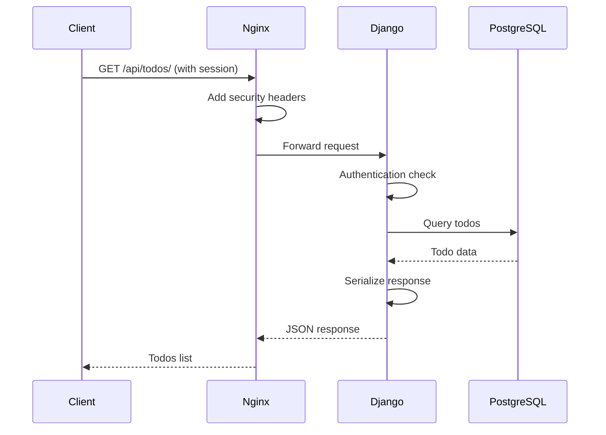
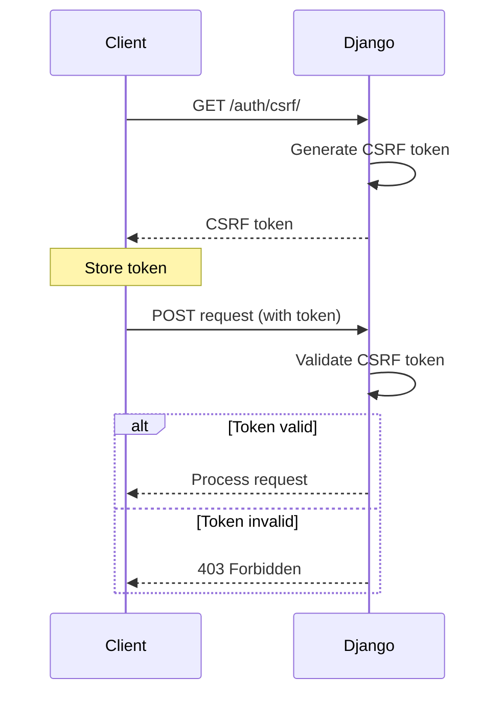

# Detailed Architecture Overview

## System Architecture Diagram

```mermaid
graph LR
    Client["🌐 Client<br/>(API Consumer)"] 
    Nginx["⚡ Nginx<br/>Reverse Proxy"]
    Django["🐍 Django<br/>REST API"]
    PostgreSQL["🐘 PostgreSQL<br/>Database"]
    
    Client -->|"HTTPS/443<br/>• HTTP Requests<br/>• CSRF Token<br/>• Session Cookies"| Nginx
    Nginx -->|"HTTP/8000<br/>• SSL Termination<br/>• Rate Limiting<br/>• Security Headers"| Django
    Django -->|"TCP/5432<br/>• REST API<br/>• Authentication<br/>• ORM Operations"| PostgreSQL
    
    subgraph "Security Layers"
        SSL["🔒 SSL/TLS"]
        Auth["🔐 Authentication"]
        CSRF["🛡️ CSRF Protection"]
        Rate["⏱️ Rate Limiting"]
    end
```



## Component Deep Dive

### 1. Client Layer

**Technologies**: Any HTTP client (Browser, Mobile App, CLI, etc.)

**Responsibilities**:
- API requests to backend endpoints
- CSRF token management for POST requests
- Session cookie handling
- Authentication token storage
- HTTP communication via REST API

**Security Features**:
- HttpOnly cookies (prevents XSS access)
- Secure flag (HTTPS only transmission)
- SameSite attribute (CSRF protection)

### 2. Web Server Layer (Nginx)

**Version**: Nginx 1.18+
**Configuration**: `/etc/nginx/sites-available/todoapp`

**Core Functions**:

#### SSL/TLS Termination
- **Protocol**: TLS 1.2/1.3
- **Cipher Suites**: Modern, secure algorithms only
- **Certificate Management**: Let's Encrypt or commercial CA
- **HSTS**: Strict-Transport-Security header enforcement

#### Reverse Proxy Configuration
```nginx
upstream django_app {
    server 127.0.0.1:8000;
    # Additional servers for load balancing
}
```

#### Rate Limiting Implementation
- **Login endpoints**: 5 requests/minute per IP
- **Auth endpoints**: 10 requests/minute per IP
- **API endpoints**: 100 requests/minute per IP
- **Burst handling**: Allow temporary spikes with delay

#### Static File Optimization
- **Gzip compression**: 6-9 compression level
- **Browser caching**: Long-term cache headers
- **HTTP/2**: Multiplexing and server push

#### Security Headers
```nginx
add_header Strict-Transport-Security "max-age=31536000; includeSubDomains" always;
add_header X-Frame-Options "SAMEORIGIN" always;
add_header X-Content-Type-Options "nosniff" always;
add_header Referrer-Policy "strict-origin-when-cross-origin" always;
```

### 3. Application Layer (Django)

**Framework**: Django 4.2+ with Django REST Framework
**WSGI Server**: Gunicorn with multiple workers

#### Core Components

**Models**:
- `User`: Extended Django user model
- `TodoList`: Container for todos
- `Todo`: Individual task items

**Authentication System**:
- **Session-based**: Django's built-in session framework
- **Password Hashing**: Argon2 algorithm (OWASP recommended)
- **CSRF Protection**: Token-based validation
- **Cookie Security**: HttpOnly, Secure, SameSite attributes

**API Architecture**:
- **REST Principles**: Resource-based URLs, HTTP methods
- **Serialization**: DRF serializers for data validation
- **Pagination**: Cursor-based for large datasets
- **Filtering**: Query parameter support

**Security Middleware Stack**:
1. SecurityMiddleware (HSTS, content type options)
2. SessionMiddleware (session management)
3. CsrfViewMiddleware (CSRF protection)
4. AuthenticationMiddleware (user authentication)
5. Custom rate limiting middleware

**Database Operations**:
- **ORM**: Django's database abstraction layer
- **Migrations**: Version-controlled schema changes
- **Connection Pooling**: Persistent database connections
- **Query Optimization**: Select_related, prefetch_related

### 4. Database Layer (PostgreSQL)

**Version**: PostgreSQL 13+
**Configuration**: Optimized for web application workloads

#### Database Design

**Tables**:
- `auth_user`: User accounts and authentication
- `todo_todolist`: Todo list containers
- `todo_todo`: Individual todo items
- `django_session`: Session storage

**Indexing Strategy**:
- Primary keys: B-tree indexes
- Foreign keys: Automatic indexing
- Query-specific: Composite indexes for common filters

**Security Features**:
- **Connection encryption**: SSL/TLS for data in transit
- **Role-based access**: Dedicated application user
- **Password authentication**: SCRAM-SHA-256
- **Network isolation**: Firewall rules, private networks

#### Performance Optimizations
- **Connection pooling**: PgBouncer for connection management
- **Query optimization**: EXPLAIN ANALYZE for slow queries
- **Vacuum scheduling**: Automated maintenance
- **Backup strategy**: Point-in-time recovery

## Data Flow Architecture

### 1. Authentication Flow


### 2. API Request Flow


### 3. CSRF Protection Flow


## Security Architecture

### Defense in Depth Strategy

```mermaid
graph TB
    subgraph "Layer 1: Network Security"
        FW["🔥 Firewall Rules<br/>Ports 80, 443 only"]
        DDOS["🛡️ DDoS Protection"]
        IP["📋 IP Whitelisting"]
    end
    
    subgraph "Layer 2: Web Server Security"
        RL["⏱️ Rate Limiting"]
        SIZE["📏 Request Size Limits"]
        HEADERS["🔒 Security Headers"]
        TLS["🔐 SSL/TLS Encryption"]
    end
    
    subgraph "Layer 3: Application Security"
        VALID["✅ Input Validation"]
        SQL["🚫 SQL Injection Prevention"]
        XSS["🛡️ XSS Protection"]
        CSRF_P["🔑 CSRF Validation"]
        SESSION["🍪 Session Security"]
    end
    
    subgraph "Layer 4: Database Security"
        ENCRYPT["🔒 Connection Encryption"]
        PRIV["👤 Least Privilege"]
        LOG["📊 Query Logging"]
        UPDATE["🔄 Security Updates"]
    end
    
    FW --> RL
    DDOS --> SIZE
    IP --> HEADERS
    RL --> VALID
    SIZE --> SQL
    HEADERS --> XSS
    TLS --> CSRF_P
    VALID --> ENCRYPT
    SQL --> PRIV
    XSS --> LOG
    CSRF_P --> UPDATE
```



## Scalability Considerations

### Horizontal Scaling Options

```mermaid
graph TB
    CDN["🌐 CDN<br/>Static Assets"]
    LB["⚖️ Load Balancer<br/>Nginx"]
    
    subgraph "Application Tier"
        D1["🐍 Django 1"]
        D2["🐍 Django 2"]
        D3["🐍 Django 3"]
    end
    
    subgraph "Caching Layer"
        Redis["🔴 Redis<br/>Sessions & Cache"]
    end
    
    subgraph "Database Tier"
        Master["🐘 PostgreSQL<br/>Master"]
        Replica1["🐘 PostgreSQL<br/>Read Replica 1"]
        Replica2["🐘 PostgreSQL<br/>Read Replica 2"]
    end
    
    CDN --> LB
    LB --> D1
    LB --> D2
    LB --> D3
    
    D1 --> Redis
    D2 --> Redis
    D3 --> Redis
    
    D1 --> Master
    D2 --> Master
    D3 --> Master
    
    D1 --> Replica1
    D2 --> Replica1
    D3 --> Replica2
    
    Master -.->|Replication| Replica1
    Master -.->|Replication| Replica2
```



### Performance Monitoring
- **Application metrics**: Response times, error rates
- **Database metrics**: Query performance, connection counts
- **Server metrics**: CPU, memory, disk I/O
- **Security metrics**: Failed login attempts, rate limit hits

## Deployment Strategy

### Containerization (Docker)
- **Multi-stage builds**: Optimized image sizes
- **Health checks**: Container lifecycle management
- **Environment variables**: Configuration management
- **Volume mounts**: Data persistence

### Infrastructure as Code
- **Docker Compose**: Local development environment
- **Production deployment**: Kubernetes or Docker Swarm
- **CI/CD pipeline**: Automated testing and deployment
- **Monitoring**: Prometheus, Grafana, ELK stack

This architecture ensures high availability, security, and maintainability while providing a solid foundation for future scaling requirements.