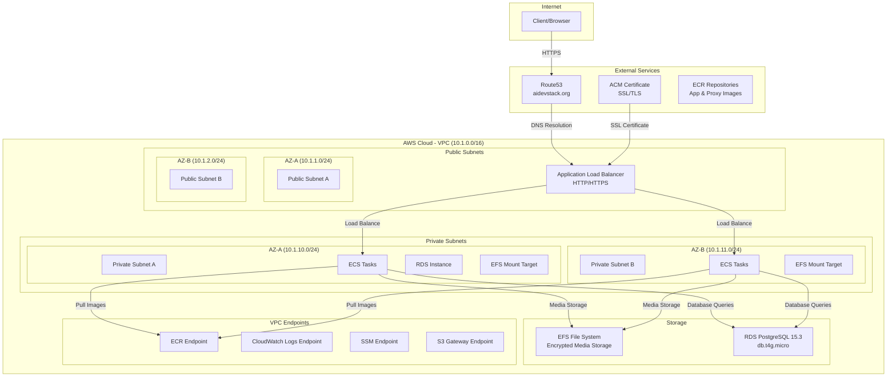

# AWS Architecture - DevOps Todo App

## Overview

This document describes the complete AWS infrastructure for the DevOps Todo App, implemented using Terraform with multi-environment support (dev, staging, prod).

## Architecture Diagram



## Infrastructure Components

### 1. Network Infrastructure

#### VPC Configuration
- **CIDR Block**: 10.1.0.0/16
- **DNS Hostnames**: Enabled
- **DNS Support**: Enabled
- **Internet Gateway**: Attached for public access

#### Subnets
**Public Subnets (ALB Access)**:
- **Subnet A**: 10.1.1.0/24 (us-east-1a)
- **Subnet B**: 10.1.2.0/24 (us-east-1b)
- **Auto-assign Public IP**: Enabled
- **Route**: 0.0.0.0/0 → Internet Gateway

**Private Subnets (ECS/RDS)**:
- **Subnet A**: 10.1.10.0/24 (us-east-1a)
- **Subnet B**: 10.1.11.0/24 (us-east-1b)
- **No Public IP**: Internal access only

#### VPC Endpoints (Private AWS Service Access)
- **ECR API**: com.amazonaws.us-east-1.ecr.api
- **ECR DKR**: com.amazonaws.us-east-1.ecr.dkr
- **CloudWatch Logs**: com.amazonaws.us-east-1.logs
- **SSM Messages**: com.amazonaws.us-east-1.ssmmessages
- **S3 Gateway**: com.amazonaws.us-east-1.s3

### 2. Load Balancer & DNS

#### Application Load Balancer
- **Type**: Application Load Balancer
- **Scheme**: Internet-facing
- **Subnets**: Public subnets (multi-AZ)
- **Security Groups**: HTTP/HTTPS access from internet

#### Listeners
- **HTTP (80)**: Redirects to HTTPS (301)
- **HTTPS (443)**: Forwards to target group
- **SSL Certificate**: ACM-managed certificate

#### Target Group
- **Protocol**: HTTP
- **Port**: 8000
- **Target Type**: IP (for ECS)
- **Health Check**: `/api/health-check/`

#### DNS & SSL
- **Domain**: aidevstack.org (Route53 hosted zone)
- **Subdomains**:
  - `api.aidevstack.org` (prod)
  - `api.staging.aidevstack.org` (staging)
  - `api.dev.aidevstack.org` (dev)
- **SSL Certificate**: ACM with DNS validation

### 3. Database Layer

#### RDS PostgreSQL
- **Engine**: PostgreSQL 15.3
- **Instance Class**: db.t4g.micro
- **Storage**: 20GB GP2
- **Multi-AZ**: Disabled (cost optimization)
- **Backup Retention**: 0 days
- **Auto Minor Version Upgrade**: Enabled
- **Subnet Group**: Private subnets only
- **Security Group**: Access from ECS only (port 5432)

#### Database Configuration
- **Database Name**: recipe
- **Username**: recipeapp (configurable)
- **Password**: Environment variable
- **SSL Mode**: Required
- **Connection Timeout**: 10 seconds

### 4. Container Platform

#### ECS Configuration
- **Launch Type**: Fargate (serverless containers)
- **Network Mode**: awsvpc
- **Subnets**: Private subnets
- **Security Groups**: Controlled access

#### Task Definition
- **CPU**: Configurable
- **Memory**: Configurable
- **Network Mode**: awsvpc
- **Execution Role**: ECS task execution role
- **Task Role**: ECS task role with SSM access

#### Container Images
- **Application**: ECR repository `devops-todo-api`
- **Proxy**: ECR repository `devops-todo-proxy`
- **Image Tags**: Git SHA for versioning

### 5. Storage Systems

#### EFS (Elastic File System)
- **Purpose**: Media file storage
- **Encryption**: Enabled at rest
- **Mount Targets**: Multi-AZ (private subnets)
- **Access Point**: `/api/media` with proper permissions
- **Security Group**: Access from ECS only (port 2049)

#### EFS Configuration
- **Owner UID/GID**: 101
- **Permissions**: 755
- **Path**: /api/media

### 6. Security Groups

#### Load Balancer Security Group
- **Inbound**:
  - HTTP (80) from 0.0.0.0/0
  - HTTPS (443) from 0.0.0.0/0
- **Outbound**:
  - HTTP (8000) to ECS security group

#### ECS Security Group
- **Inbound**:
  - HTTP (8000) from ALB security group
- **Outbound**:
  - PostgreSQL (5432) to RDS security group
  - NFS (2049) to EFS security group
  - HTTPS (443) to VPC endpoints

#### RDS Security Group
- **Inbound**:
  - PostgreSQL (5432) from ECS security group
- **Outbound**: None

#### EFS Security Group
- **Inbound**:
  - NFS (2049) from ECS security group
- **Outbound**: None

#### VPC Endpoint Security Group
- **Inbound**:
  - HTTPS (443) from VPC CIDR (10.1.0.0/16)
- **Outbound**: None

## Environment Management

### Terraform Workspaces
- **dev**: Development environment
- **staging**: Staging environment
- **prod**: Production environment

### Resource Naming
- **Prefix**: `raa-{workspace}`
- **Example**: `raa-dev-lb`, `raa-prod-db`

### Environment-Specific Configuration
```hcl
variable "subdomain" {
  default = {
    prod    = "api"
    staging = "api.staging"
    dev     = "api.dev"
  }
}
```

## IAM Roles & Policies

### CD User (todo-app-api-cd)
**Policies**:
- **Terraform Backend**: S3 and DynamoDB access
- **ECR**: Push/pull container images
- **EC2**: VPC and security group management
- **RDS**: Database instance management
- **ECS**: Container service management
- **ELB**: Load balancer management
- **EFS**: File system management
- **Route53**: DNS record management
- **CloudWatch**: Logging and monitoring
- **IAM**: Role and policy management

### ECS Task Execution Role
**Policies**:
- **ECR**: Pull container images
- **CloudWatch**: Create log streams and put log events

### ECS Task Role
**Policies**:
- **SSM**: Systems Manager access for debugging

## Deployment Pipeline

### Setup Phase
1. **S3 Bucket**: Terraform state storage
2. **DynamoDB Table**: State locking
3. **IAM User**: CD permissions
4. **ECR Repositories**: Container image storage

### Deploy Phase
1. **Network**: VPC, subnets, security groups
2. **Database**: RDS PostgreSQL instance
3. **Storage**: EFS file system
4. **Load Balancer**: ALB with SSL certificate
5. **DNS**: Route53 records
6. **Container Platform**: ECS service (when implemented)

## Monitoring & Logging

### CloudWatch Integration
- **VPC Endpoint**: Private access to CloudWatch Logs
- **Log Groups**: Application and infrastructure logs
- **Metrics**: Custom application metrics

### Health Checks
- **ALB Target Group**: `/api/health-check/` endpoint
- **Database**: Connection health monitoring
- **EFS**: Mount target availability

## Security Features

### Network Security
- **Private Subnets**: Database and application isolation
- **Security Groups**: Least privilege access
- **VPC Endpoints**: Private AWS service access
- **No Public Database**: RDS in private subnets only

### Data Security
- **EFS Encryption**: At-rest encryption enabled
- **SSL/TLS**: End-to-end encryption
- **Database SSL**: Required connections
- **Secrets Management**: Environment variables

### Access Control
- **IAM Roles**: Least privilege principles
- **Security Groups**: Port-specific access
- **Route53**: DNS-based access control

## Cost Optimization

### Instance Sizing
- **RDS**: db.t4g.micro (burstable performance)
- **EFS**: Standard storage class
- **ALB**: Application Load Balancer (cost-effective)

### Multi-AZ Strategy
- **RDS Multi-AZ**: Disabled for cost savings
- **EFS**: Multi-AZ mount targets for availability
- **ALB**: Multi-AZ for high availability

## Disaster Recovery

### Backup Strategy
- **RDS**: Automated backups disabled (dev/staging)
- **EFS**: Built-in durability and availability
- **Infrastructure**: Terraform state in S3

### Recovery Procedures
- **Infrastructure**: Terraform apply from state
- **Database**: Manual backup/restore process
- **Application**: Container redeployment

## Scalability Considerations

### Horizontal Scaling
- **ECS**: Auto-scaling groups (future implementation)
- **RDS**: Read replicas (future enhancement)
- **ALB**: Built-in load distribution

### Vertical Scaling
- **RDS**: Instance class upgrades
- **ECS**: CPU/memory adjustments
- **EFS**: Automatic scaling

This architecture provides a production-ready, secure, and scalable foundation for the DevOps Todo App with proper separation of concerns and multi-environment support.